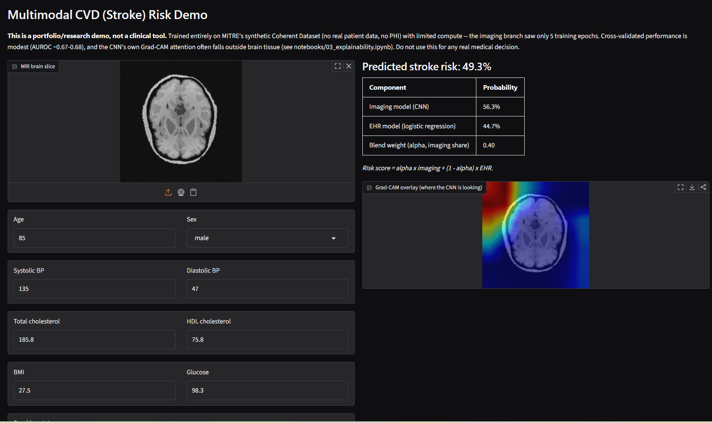

# Multimodal Stroke Risk Prediction

Predicting stroke risk by fusing **MRI brain imaging** with **structured EHR data**, using MITRE's synthetic Coherent Dataset. A portfolio project demonstrating applied deep learning and multimodal fusion, built from a credit-risk/scorecard modeling background — the tabular-modeling half leans directly on that experience (missing-value indicators, standardized coefficients, regularized logistic regression), while the imaging and fusion half is new territory documented as it was learned.



## Problem statement

Cardiovascular disease risk models today almost always use one data modality at a time — either imaging or structured clinical records, rarely both together in one model. This project builds a small, honest, end-to-end example of the alternative: fuse a brain MRI scan with a patient's vitals/labs/demographics into a single risk score, using the standard "joint fusion" pattern (independent encoders per modality, combined only at the end):

```
MRI scan  → CNN encoder     → image embedding  ┐
                                                  ├→ combine → classifier → risk score
EHR record → feature engineering → feature vector ┘
```

The label was narrowed from the broader "any cardiovascular disease" to **stroke specifically**. The only imaging modality available is a brain MRI, which has plausible signal for cerebrovascular events (stroke) but essentially none for purely cardiac conditions (atrial fibrillation, coronary heart disease, heart failure) — an early check found a broad CVD label was 93% positive, driven mostly by cardiac diagnoses a brain scan has no way to inform. Narrowing to stroke both fixed that near-degenerate class balance (down to a workable 55%/45%) and gave the imaging branch a real reason to matter.

## Dataset

[MITRE's Coherent Dataset](https://registry.opendata.aws/synthea-coherent-data/) — public, **fully synthetic**, generated by Synthea. No real patient data, no PHI, no compliance concerns, no application or approval needed. It links several modalities for the same synthetic patient via shared FHIR resources: DICOM brain MRI scans, structured EHR (conditions, observations, medications, vitals, demographics), genomics, and clinical notes. This project uses the MRI and EHR modalities.

- 1278 synthetic patients total; only **298 have a linked brain MRI** (not every synthetic patient was imaged) — that 298-patient subset is the common cohort used everywhere a model needs both modalities, including the EHR-only baseline, so the final comparison is apples-to-apples.
- Each DICOM volume is 256×256×256; slices roughly outside [70, 185) are noise-only per the reference implementation and get dropped.
- The stroke label: 698 positive / 580 negative across the full 1278-patient cohort (54.6%/45.4%), derived from `Condition` resources.

## Architecture and approach

- **Imaging branch**: pretrained ResNet-18 (`IMAGENET1K_V1`), fine-tuned per CV fold on individual brain-MRI slices (each grayscale slice replicated to 3 channels to keep the pretrained weights usable unmodified, rather than adapting the first conv layer to 1-channel input the way the reference implementation did). 115 clean slices × 298 patients = 34,270 training examples, far more than 298 patient-level volumes would give a CNN this small a dataset.
- **EHR branch**: standard scorecard-style feature engineering (missing-value indicators before median imputation, explicit "Unknown" category rather than mode imputation, standardization) feeding a regularized, class-weighted logistic regression.
- **Fusion — two approaches were built and compared, not just one:**
  - **Joint fusion**: the CNN's pooled 512-dim embedding (PCA-reduced to 32 components to avoid outnumbering the ~238 training patients per fold) concatenated with the EHR feature vector, into one logistic regression.
  - **Late fusion**: a weighted average of the two standalone models' own predicted probabilities, `alpha * imaging_prob + (1 - alpha) * ehr_prob`, with `alpha` tuned via cross-validation.
- Evaluation throughout: **5-fold cross-validation, split at the patient level** (never at the slice level — all of one patient's 115 slices always land in the same fold, or the imaging model would effectively be evaluated on scans of patients it already trained on).

## Results

| Model | AUROC | Sensitivity | Specificity |
|---|---|---|---|
| Imaging-only | 0.557 ± 0.049 | 0.530 ± 0.349 | 0.538 ± 0.321 |
| EHR-only | 0.674 ± 0.065 | 0.631 ± 0.053 | 0.608 ± 0.079 |
| Joint fusion | 0.621 ± 0.078 | 0.685 ± 0.079 | 0.492 ± 0.195 |
| Late fusion | **0.672 ± 0.057** | 0.655 ± 0.118 | 0.646 ± 0.142 |

(mean ± std across 5 CV folds; `data/processed/comparison_table.csv`)

**The progression tells a coherent story, not just a leaderboard:**

- **Imaging-only** is weak (AUROC 0.557, barely above chance) — but diagnosably so, not mysteriously. The imaging branch only got 5 training epochs (~6 hours on Kaggle's free-tier GPU was already the compute budget for that), and Grad-CAM on the trained model shows why that shows up: for a correctly-classified patient, the CNN's highest attention sits at the image periphery/background rather than brain tissue (see `notebooks/03_explainability.ipynb`). Two independent diagnostics — near-chance aggregate metrics, and pixel-level attention landing outside the anatomy — point the same way.
- **EHR-only** is the strongest single baseline (AUROC 0.674). Its logistic regression coefficients are directly interpretable: age dominates (odds ratio ≈ 2.0 per standard deviation), systolic BP is second (≈ 1.4), and — a genuinely interesting side-finding — the missing-value indicator flags for cholesterol and for BP/BMI carry real, opposite-signed weight, because those labs/vitals go missing together within their own panel (the model can't tell the individual flags apart, only "missingness of this type" as a group).
- **Joint fusion underperforms EHR-only** (0.621 vs. 0.674). This is a structural property of concatenation, not a bug: a single linear classifier over concatenated features has no mechanism to selectively discount a noisy input — every feature folds into one weight vector, so a weak imaging branch can drag down an otherwise-strong EHR signal instead of adding to it.
- **Late fusion roughly matches EHR-only** (0.672 vs. 0.674 — a 0.002 gap that's noise, not signal, given a std of ~0.06), and edges it out on sensitivity and specificity. Unlike joint fusion, late fusion *can* discount a noisy branch: its per-fold tuned weights ended up favoring EHR (e.g. one fold tunes `alpha` to exactly 0.00, pure EHR) once the tuning procedure itself was corrected. An earlier version of that tuning had a real leakage bug — the EHR side of the blend used genuine out-of-fold predictions, but the imaging side reused each fold's own in-sample training predictions, which look more discriminative than the model's true generalization. Fixed by sourcing every patient's imaging probability from whichever fold actually held them out (each patient is the validation patient of exactly one of the 5 folds, so that fold's prediction for them is a legitimate holdout estimate) — no CNN retraining required, purely a bookkeeping fix. That single fix moved late fusion's AUROC from 0.620 (tied with joint fusion) to 0.672 (matching EHR-only).

**Bottom line**: neither fusion approach clearly *beats* the best single modality here, but late fusion clearly beats joint fusion, and it does so for a real, explainable reason (the ability to discount a weak branch) rather than luck. With a properly-trained imaging model (more epochs, more compute), both fusion numbers would plausibly move further.

## Known limitations

- **Synthetic data.** Every patient, scan, and lab value here is generated by Synthea, not a real clinical population. Findings (which features matter, how well fusion works) may not transfer to real-world stroke risk data.
- **Small sample.** Only 298 patients have both modalities; cross-validation fold sizes are ~238 train / ~60 validation. Several per-fold metrics (especially sensitivity/specificity) have wide variance as a result.
- **Imaging branch undertrained.** 5 epochs on a free-tier GPU, not the dozens of epochs a production imaging model would get. The near-chance AUROC and off-target Grad-CAM attention both trace back to this, not to an absence of learnable signal in the data (the underlying embeddings do show real per-patient structure — see `notebooks/03_explainability.ipynb`).
- **Fusion doesn't beat the best single baseline.** Documented above as a genuine, diagnosed result rather than smoothed over.
- **Not clinically validated**, not intended for and not usable for any real medical decision (also stated directly in the demo app's UI).

## Explainability

- `notebooks/03_explainability.ipynb` — EHR feature-importance (logistic regression coefficients/odds ratios) and Grad-CAM on the CNN branch, using a real trained checkpoint.
- The Gradio app itself shows a live Grad-CAM overlay for whatever slice is uploaded.

## Try it

**Run it locally** (no HF Spaces account needed):

```bash
git clone https://github.com/jaideep2015/multimodal-stroke-risk.git
cd multimodal-stroke-risk
pip install -r requirements.txt
python app/gradio_app.py
```

Then open the local URL it prints (typically `http://127.0.0.1:7860`). Startup takes ~45 seconds (loading the checkpoint, fitting the final EHR model, tuning the fusion weight) before the app is ready. Two example patients are built in for one-click testing — no need to source your own MRI file.

**Or deploy it** on [Hugging Face Spaces](https://huggingface.co/spaces) (free tier, Gradio SDK) — the app is self-contained once `requirements.txt` is installed; the only thing worth knowing is that `data/processed/checkpoints/mri_fold0.pt` (43MB) needs Git LFS tracking (`git lfs track "*.pt"`) since HF Hub requires LFS for files over 10MB.

See the screenshot at the top of this README for what the running app looks like (form on the left, risk breakdown and Grad-CAM overlay on the right).

## Repository structure

```
src/data/       FHIR parsing, fold assignment, MRI Dataset, EHR feature pipeline
src/models/     Imaging (CNN) and EHR (logistic regression) baseline training
src/fusion/     Joint + late fusion models, and the real inference path the app calls
app/            Gradio demo (app/gradio_app.py) + example patient images
notebooks/      EDA (01) and explainability (03)
data/processed/ Committed: per-fold metrics/embeddings, comparison table, fold-0
                 checkpoint, patient cohort/fold assignment. Gitignored: the raw
                 9GB Coherent dataset and the other 4 folds' checkpoints.
```

## Reproducing from scratch

The commands above are enough to run the demo using the already-committed model artifacts. To regenerate everything from the raw dataset (needs the Coherent dataset and, for the imaging model, a GPU — Colab/Kaggle free tier is enough):

```bash
# 1. Download the dataset (public, no application needed) and extract it so
#    you end up with data/raw/coherent/{csv,dicom,dna,fhir} (rename the
#    extracted folder to "coherent" if it comes out named differently)
wget https://synthea-open-data.s3.amazonaws.com/coherent/coherent-11-07-2022.zip -P data/raw/
unzip data/raw/coherent-11-07-2022.zip -d data/raw/
ls data/raw/coherent  # sanity check: should show csv/ dicom/ dna/ fhir/

# 2. Build the patient cohort and CV folds
python src/data/parse_fhir.py
python src/data/folds.py

# 3. Train the imaging baseline (GPU recommended; ~1hr+/fold on a free-tier GPU)
python src/models/mri_model.py

# 4. Train the EHR baseline (CPU, seconds)
python src/models/ehr_model.py

# 5. Run both fusion approaches and rebuild the comparison table
python src/fusion/fusion_model.py

# 6. Launch the demo
python app/gradio_app.py
```

## License

MIT — see [LICENSE](LICENSE).

---

See [CLAUDE.md](CLAUDE.md) for the full original build plan this project followed phase by phase.
